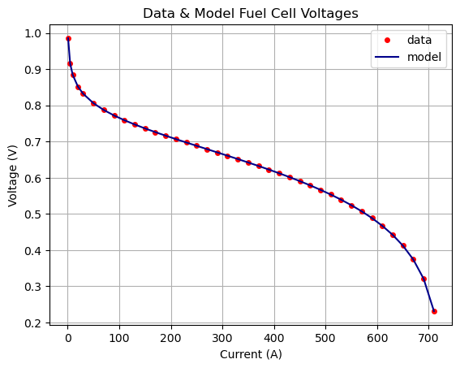
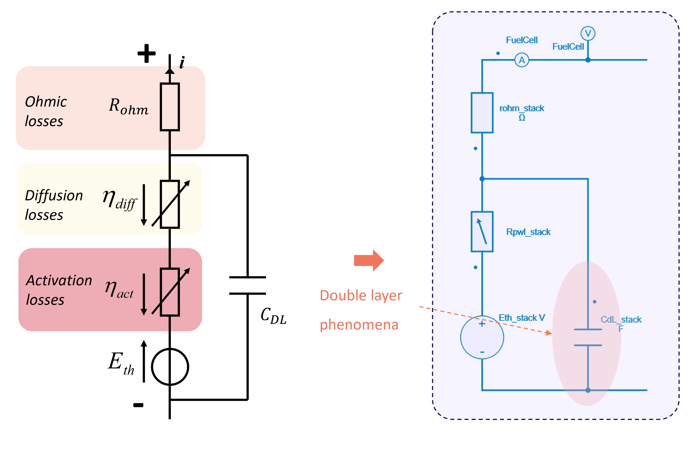

---
tags:
  - Python
  - Renewable Energies
---

# Fuel Cell Modeling with SIMBA

[Download **python script**](fuelcell_modeling.py)


[Download **Simba model**](fuelcel_modeling.jsimba)


This python script proposes different implementations of fuel cell modeling and methods to extract their parameters from a typical $(v, i)$ experimental polarization curve.


## Fuel Cell Models

The fuel cell models considered here rely on the following expression - derived from [^1] - of a fuel cell voltage $V_{fc}$ depending on fuel cell current $i_{fc}$:

$$V_{fc} = E_{th} - \dfrac{RT}{\alpha nF} \ln\left(\dfrac{i_{fc}}{i_0}\right) + \dfrac{RT}{\beta nF} \ln \left(1 - \dfrac{i_{fc}}{i_{lim}}\right) - R_{ohm}.i_{fc} $$

where:

* $E_{th}(T, P)$ is the theoretical potential of the fuel cell voltage, depending on gas pressures and temperature. It is equal to 1.23V for a gas pressures of 1 bar and a temperature of 25°C,
* $T$ is the temperature,
* $R$ is the perfect gas constant,
* $\alpha$ is the transfer coefficient (or symmetry factor),
* $n$ if the number of electron moles transferred during the chemical reaction,
* $F$ is the Faraday constant,
* $i_0$ is the activation current,
* $\beta$ is an empirical coefficient, similar to $\alpha$ (it is sometimes replaced by $\frac{1}{\beta} = 1 + \frac{1}{\alpha}$),
* $R_{ohm}$ is a linear resistance to model ohmic phenomena in the fuel cell.

As the temperature and the gas pressure are assumed to be known and set, the expression above can be re-written:

$$V_{fc} = E_{th} - A \ln\left(\dfrac{i_{fc}}{i_0}\right) + B \ln \left(1 - \dfrac{i_{fc}}{i_{lim}}\right) - R_{ohm}.i_{fc} $$

where $A$ and $B$ are respectively Tafel and diffusion slopes.

Three different implementations of fuel cell models are proposed here:

1. a first implementation where the fuel cell voltage is modeled with a controlled voltage source. This voltage source is driven by a C-code which contains the expression above;
2. a second implementation where an equivalent electrical circuit with voltage source, a resistor and a non-linear resistor are used;
3. a third implementation based on the previous one and which considers the dynamic of the electrochemical double layer modeled by a capacitor.


## Extraction of Fuel Cell Model Parameters

### Get main parameters: $A, i_0, B, i_{lim}, R_{ohm}$

This step aims to determine the parameters of the fuel cell voltage expression (written above) from a typical $(v, i)$ polarization curve. It uses the [curve_fit](https://docs.scipy.org/doc/scipy/reference/generated/scipy.optimize.curve_fit.html){:target="_blank"} function (based on non-linear least squares) from Scipy.optimize module.

The principle is simple and an extract of the code is shown below:

* the function `get_fuelcell_voltage` is defined to compute the fuel cell voltage from model parameters $A, i_0, B, i_{lim}, R_{ohm}$ and the fuel cell current $i_{fc}$,
* the `curve_fit` function is then used to determine parameters to fit the experimental data, *data_current* and *data_voltage*.

```py
def get_fuelcell_voltage(ifc, A, io, B, rohm, iLim):
    vfc = Eth - A * np.log(ifc / io) + B * np.log(1 - ifc / iLim) - rohm * ifc
    return vfc

[A, io, B, rohm, iLim], _ = curve_fit(get_fuelcell_voltage, data_current, data_voltage, bounds=((1e-9, 1e-9, 1e-9, 1e-6, max(data_current)), (1e-1, 1, 3e-1, 1e-1, 2*max(data_current))))
```

The figure below shows experimental data and model outputs:




### Get PWL resistor to model activation and diffusion losses in 2nd and 3rd models

This step aims to get a PWL resistor to model non-linear losses such as activation or diffusion losses. Here, a single PWL resistor is used to model both activation and diffusion losses.

Here is the non-linear function to consider:

```py
def compute_non_linear_losses(i):
    return  A * np.log(i/io) - B * np.log(1 - i/iLim)
```

To properly model the non-linear losses with a PWL resistor, its voltage-current segments must be carefully chosen.
For this, the ideal locations of the current breakpoints (for a given number of breakpoints) is determined with a customized *pwl* function named `get_pwfl_breakpoints()` based on this [PiecewiseLinFit](https://github.com/cjekel/piecewise_linear_fit_py){:target="_blank"} function from *pwl* module.

It can be used as follows:

* define a current vector with a large number of points on the whole current range of the fuel cell,
* compute non-linear losses from this current vector,
* get current breakpoints with our cutsomize function *get_pwfl_breakpoints()*
* compute voltage breakpoints from current breakpoints with the non-linear function.

```py
iLinspace = np.linspace(10*io, iLim/1.05, int(1e4))
non_linear_losses = compute_non_linear_losses(iLinspace)
[iBreakpoints, _, _] = get_pwfl_breakpoints(iLinspace, non_linear_losses, 11)
vBreakpoints = compute_non_linear_losses(iBreakpoints)
```

The figure below shows the comparison between the mathematical expression to model the non-linear diffusion and activation losses and the determined breakpoints which will be used to define the PWL resistor.


## Comparison of the different implementations of Fuel Cell Models

### Fuel Cell Model with a controlled voltage source by a C-code

This model implementation is illustrated in the figure below:


### Fuel Cell Model with a PWL resistor

This model implementation is illustrated in the figure below:


### Fuel Cell Model with the dynamic of the double layer capacitor

This model implementation is illustrated in the figure below. It can be interested to consider the doubler layer capacitor as this last one will have a high impact on the filtering of the current harmonics applied to the fuel cell [^2].



### Result comparison

The figure below shows the results obtained with these three different implementations.


For the dynamic model, the "hysteresis" loops at low and high currents are due to the interaction between the non-linear losses (respectively action losses at low currents and diffusion losses at high currents) and the double layer capacitor.

[^1]: XXX Larminie & Dicks.

[^2]: G. Fontes, C. Turpin, S. Astier, et T. A. Meynard, ["Interactions Between Fuel Cells and Power Converters: Influence of Current Harmonics on a Fuel Cell Stack", IEEE Transactions on Power Electronics, vol. 22, n°2, mars 2007](https://doi.org/10.1109/TPEL.2006.890008)