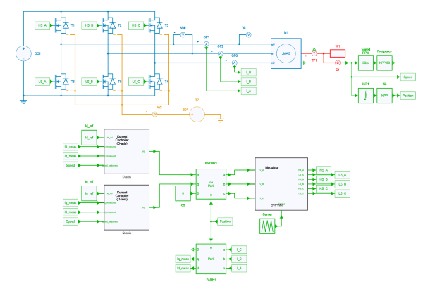
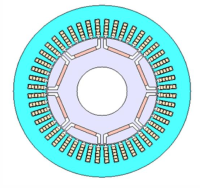

---

tags:
  - Python
  - Motor Drives
  - JMAG
  - Control

---


## Parallel Execution of Parametric SIMBA–JMAG Co-Simulations

[Download **Python file**](RunSimbaCosim_MultiProcess.py)

[Download **Simba model**](./original/Co-simulation_with_JMAG_FEA_Model.jsimba)

[Download **JMAG motor model**](./original/Co-simulation_with_JMAG_FEA_Model.jcf)

[Download **JMAG port information xml**](./original/Co-simulation_with_JMAG_FEA_Model_csl.xml)

!!! info
    The example script assumes that all simulation files (.jsimba, .jcf, and .xml) are stored in a folder named original. To prevent file conflicts during parallel execution, the script automatically creates a dedicated working directory for each simulation case based on the contents of the original folder. When downloading the example files, please preserve this folder structure to ensure the script runs correctly.

## Introduction
This tutorial demonstrates how to automate SIMBA–JMAG co-simulations using Python and execute multiple simulation cases in parallel using the SIMBA Parallel Simulation license together with Python's multiprocessing module. The workflow is suitable for parametric studies, optimization support, benchmarking, and large-scale design exploration.

JMAG is an FEA software developed by JSOL Corporation for the design and simulation of electromagnetic components, including motors and transformers. Both JMAG and JMAG-Designer are registered trademarks of JSOL Corporation.  (https://www.jmag-international.com/)

!!! info
    This sample is configured with a very short simulation time (1.0e-4 s) and a relatively large subcycling rate (20). These settings were chosen only to keep the demonstration runtime short. For production use, you will likely need to adjust these values to match your specific application. As a reference, execution of four simulation cases in parallel takes approximately 10 seconds on an AMD Ryzen 7 PRO 3.3 GHz system.


## Objectives
The script demonstrates the following key concepts:

**1. Activating a PSL License from a Python Script**

In this example, the environment variable JMAG_MULTI_CALCULATION is set to "1" within the Python script to enable JMAG PSL licensing.

**2. Setting Up Parametric Simulations in SIMBA Using Python**

The sample simulates a three-phase PMSM co-simulation while sweeping four different carrier frequencies as parametric inputs.

**3. Creating Dedicated Working Directories for Parallel Simulations**

To prevent file conflicts during parallel execution, the script automatically creates a separate working directory for each simulation case. In this example, a dedicated folder is created for each carrier frequency, allowing JMAG and SIMBA to generate outputs independently without overwriting one another.

**4. Running Simulations Concurrently Using Python Multiprocessing**

The script uses Python's multiprocessing library to execute multiple simulation cases in parallel. In the provided example, four simulations are launched simultaneously as four separate processes.

## Prerequisites
- SIMBA installed
- JMAG-Designer installed
- SIMBA Parallel Simulation licenses available
- Python packages:

```bash
pip install matplotlib tqdm
```
!!! info
    JMAG requires an environment variable named "InsDir" to be defined on your machine. This variable must be set to the path of the JMAG installation folder. For instance, if you have installed JMAG v24.1 in the default directory, you should set the variable as follows: InsDir=C:\Program Files\JMAG-Designer24.1


## Simulation Configuration
The script configures:
- JMAG PSL licensing via JMAG_MULTI_CALCULATION
- JMAG installation directory
- Input .jsimba, .jcf, and .xml files
- Carrier frequency sweep
- Transient simulation time step and end time

Example:

```python
carrier_frequencies = [3300, 5000, 10000, 20000]
```

## Workflow
1. Create simulation folders.
2. Copy original model files.
3. Update SIMBA and JMAG parameters.
4. Launch simulations in parallel.
5. Export results.
6. Generate plots.
7. Write execution logs.

## Motor drive inverter model
The motor drive inverter model consists of a 3-phase 2-level voltage source inverter (VSI) and the current vector control with PI current regulator. As a control target motor, an 8-pole 48-slot PMSM model is used. The details of control and co-simulation settincs can be found in [Co-simulation with JMAG FEA Model](https://simba.io/resources/03-AdvancedExamples/13-Co-simulation-JMAG/readme.html).

 

## Python script details
### Input Model Preparation
The `setup_inputs()` function creates an independent working folder for each simulation case.

Example:

```text
test_N=20_CarrierFreq=3300Hz
test_N=20_CarrierFreq=5000Hz
```

Each folder contains dedicated copies of the project files, preventing conflicts during parallel execution.

### Updating Model Parameters
The script programmatically updates:

```python
JMAGblock.SubcyclingRate = i
design.Circuit.SetVariableValue("fpwm", str(j))
```

It also updates:
- JMAG input file paths
- XML paths
- DLL paths
- Transient simulation settings

### Parallel Execution
The number of simultaneous simulations is controlled by:

```python
num_parallel_simulations = 4
```

The simulation list is automatically divided into batches to avoid exceeding the available SIMBA parallel-license count.

### Multiprocessing Architecture
The implementation uses:

```python
multiprocessing.Pool
pool.imap_unordered()
```

This allows simulation jobs to run independently and return results as soon as they finish.

### Logging
The example uses:

```python
logging.handlers.QueueHandler
logging.handlers.QueueListener
```

to ensure thread-safe logging when multiple worker processes are running.

### Result Extraction
The following signals are extracted:

```text
CP1 - Current
CP2 - Current
CP3 - Current
M1 - Te0
```

### Exported Results
Generated files:

```text
simba_current.csv
simba_torque.csv
simba_current.png
simba_torque.png
```

The CSV files can be imported into Excel, MATLAB, or Python for additional post-processing.

### Output Structure
```text
test_N=20_CarrierFreq=10000Hz
│
├── Co-simulation_with_JMAG_FEA_Model.jsimba
├── Co-simulation_with_JMAG_FEA_Model.jcf
├── Co-simulation_with_JMAG_FEA_Model_csl.xml
├── simba_current.csv
├── simba_torque.csv
├── simba_current.png
├── simba_torque.png
└── JMAG output files
```
